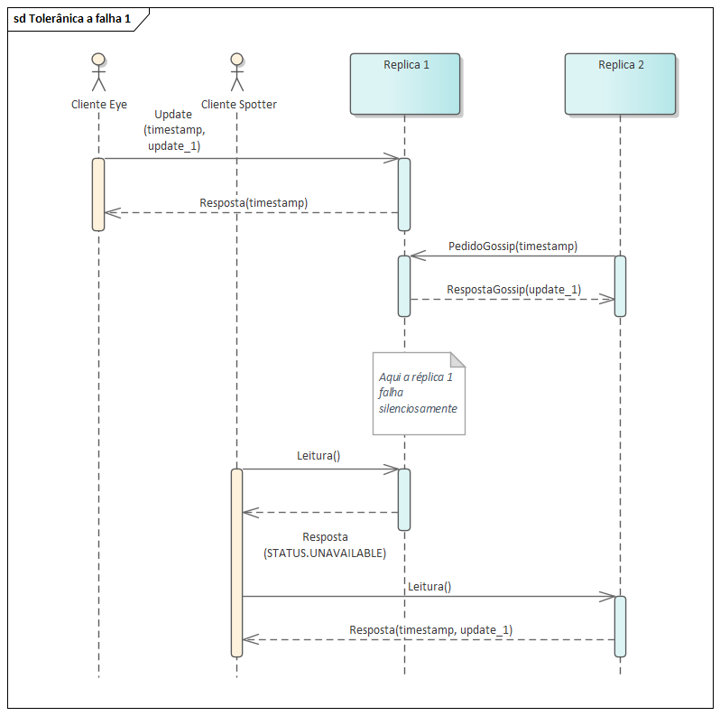

# Relatório do projeto Sauron

Sistemas Distribuídos 2019-2020, segundo semestre

## Autores

**Grupo A53**

| Número | Nome              | Utilizador                           | Correio eletrónico                                |
| -------|-------------------|--------------------------------------|---------------------------------------------------|
| 89414  | Andreia Pereira   | <https://github.com/decasppereira>   | <mailto:andreia.sofia.pereira@tecnico.ulisboa.pt>  |
| 89433  | Diogo Pacheco     | <https://github.com/Dpac99>          | <mailto:diogo.a.pacheco@tecnico.ulisboa.pt>       |
| 89550  | Tiago Lé          | <https://github.com/tigasgon1999>    | <mailto:tiagopgle@tecnico.ulisboa.pt>             |
 
  
 
 

## Melhorias da primeira parte

- [Correção do comando sleep no Eye](https://github.com/tecnico-distsys/A53-Sauron/commit/eca983dfa134c20d71c51e73d5fc6326c902ded9)
- [Adicionados comentários ao Eye, Spotter e silo-server](https://github.com/tecnico-distsys/A53-Sauron/commit/7d5347325df01cad4c305a2c213032ad0afad4b0)
- [Diferenciados pedidos e respostas dos comandos track, trackMatch e trace](https://github.com/tecnico-distsys/A53-Sauron/commit/7d5347325df01cad4c305a2c213032ad0afad4b0)
- [Completado o guião de demonstração relativo à 1ª entrega](https://github.com/tecnico-distsys/A53-Sauron/commit/7d5347325df01cad4c305a2c213032ad0afad4b0)
 ---
## Modelo de faltas

Não são toleradas faltas no ZooKeeper. 

Assumimos que os gestores de réplica apenas falham silenciosamente, e que não existem falhas bizantinas. Assim, também não são toleradas falhas bizantinas. Igualmente, assumimos que as falhas nas réplicas são transientes. 

Como o protocolo é de coerência fraca, seria possível um cliente fazer leituras incoerentes. Contudo, decidimos pelo menos garantir que o cliente não retorna leituras desatualizadas depois de já ter lido um valor mais recente. 

A tolerância a partições (P) e a alta disponibilidade (A) do teorema CAP são asseguradas devido à existência de várias réplicas, devido à redundância que a existência de várias réplicas assegura.

---
## Solução

 

### Gestão de Faltas no Cliente
Toda a gestão de faltas feita no lado do cliente acontece no SiloServerFrontend.
As falhas silenciosas das réplicas são detetadas a partir das exceções do grpc recebidas pelo cliente, com os seguintes Status Codes - `Status.Code.UNAVAILABLE` e `Status.Code.DEADLINE_EXCEEDED`. 
No 1º caso, em que a réplica está indisponível, o cliente vai-se ligar a uma nova réplica, ao invocar o método connectRandom().
No 2º caso, em que houve uma falha na comunicação, estabelecemos que o cliente vai-se tentar ligar à mesma réplica mais 2 vezes. Se, ao fim das 3 tentativas, a comunicação continuar comprometida, então o método connectRandom() é invocado, de modo a que o cliente se ligue a uma nova réplica. 

No caso do Eye, é feito um pedido camJoin a cada vez que o Eye se liga a uma réplica. Como o camJoin é idempotente (regista a câmara se esta não existir e não faz nada se a câmara já existir), pode ser utilizado para garantir que, ao ligar-se a uma nova réplica, seja possível que o Eye reporte observações.

### Leituras Coerentes no Cliente
Define-se leitura incoerente:
   * Se um cliente efetua uma leitura Ln que reflete o *update* Un, e, posteriormente, efetua uma leitura Ln+1 que reflete, no máximo, o *update* Un-1 (sendo Un-1 anterior a Un), então Ln+1 é **incoerente**.
A nossa solução para este problema tem base em dois mecanismos: Um *timestamp* vectorial mantido pelo cliente e uma cache de resultados.
O *timestamp* é atualizado a cada resposta proveniente do servidor. Para cada entrada, se `clientTimestamp[i] < responseTimestamp[i]`, atualiza o valor do cliente com o valor da resposta. Isto permite ao cliente saber quando recebe um valor desatualizado. Se, para uma dada entrada *i* do *timestamp*, o valor `clientTimestamp[i] > responseTimestamp[i]`, então o cliente já recebeu anteriormente uma resposta que reflete um *update* mais recente. É nesta situação que recorremos ao segundo mecanismo, a cache.

Implementamos uma cache totalmente associativa, que guarda as respostas aos pedidos mais recentes. Cada pedido é identificado unicamente baseado no tipo de pedido e nos argumentos (por exemplo, `trace_person_132`). Esta cache guarda, por *default*, os 32 pedidos mais recentes, substituíndo o mais antigo ou, se já existir na cache o mesmo pedido, substitui este e move-o para o fim da lista.

Estes dois mecanismos aliados permitem detetar respostas desatualizadas e, nesse caso, ir buscar a última resposta conhecida para este pedido. Assim, garante-se que leituras incoerentes no cliente são minimizadas. Mais detalhadamente:

Um cliente efetua uma leitura **Ln** que reflete o update **Un**. Se, posteriormente, o cliente re-efetua a leitura **Ln**, 3 coisas podem acontecer:
   * Se a resposta for atual (**Uk** >= **Un**), então devolve se a mesma, atualiza-se o *timestamp* do cliente e guarda se a resposta em cache;
   * Se a resposta não for atual e o pedido estiver em cache, devolve se o que está guardado na cache (**Un**);
   * Se a resposta não for atual e o pedido não estiver em cache, então vemo-nos forçados a devolver um resultado potencialmente incoerente. No entanto, a taxa de ocorrência deste caso é inversamente proporcional ao tamanho da cache (pois os resultados ficam guardados mais tempo) e diretamente proporcional à duração do intervalo entre pedidos de *gossip* (a informação chega mais rápido às outras réplicas), estando assim sobre nosso controlo.

---
## Protocolo de replicação
O protocolo implementado é uma variante do protocolo gossip, com coerência fraca.
Os clientes apenas comunicam com uma réplica por cada operação que executam. O cliente comunica sempre com a mesma réplica até que seja detetada uma falha na mesma (procedimento descrito acima). 

Utiliza-se a estrutura do *timestamp* vetorial, que permitirá tanto às réplicas como aos clientes identificar a versão de um conjunto de updates e, consequentemente, se um update é atual ou não. Para N réplicas, o timestamp vetorial é um vetor de tamanho N em que cada posição i do vetor contém o número de sequência da última operação conhecida na réplica i. 

Escolhemos propagar updates periodicamente (a cada 30s), mantendo um *update log* em cada réplica, que mantém os updates recebidos pela réplica (na mesma ordem que foram recebidos). Optamos por usar a variante **PULL** do mecanismo *gossip*. Significa isto que uma réplica (**R1**) pede atualizações a outra (**R2**), enviado o seu *timestamp*. **R2** analiza o *timestamp* recebido e, com base nisto, envia a **R1** os updates que estima que **R1** não tenha. **R1** recebe, garante que os *updates* não são repetidos, e adiciona-os ao Silo e ao *update log*, que vamos discutir a seguir.   

Cada réplica mantém também um *update log*, em que mantém os *updates* que recebe. Estes updates estão mapeados por réplica e ordenados cronologicamente. Assim, cada update é unicamente identificado pelo tuplo (*replica_id*, *update_id*) (*Update* *update_id* da réplica *replica_id*). Este *log* é usado para poder manter outras réplicas atualizadas bem como para impedir a inserção de informação duplicada no Silo.

No nosso modelo há 3 formas distintas de interação:
   * ##### Cliente-Réplica através de leitura:
      * Nesta situação um cliente efetua uma leitura. Envia à réplica um pedido e a réplica responde com o valor correspondente à leitura pedida e o seu *timestamp*. Ao receber a resposta, o cliente compara os timestamps e [decide a ação a tomar](#leituras-coerentes-no-cliente). A composição detalhada das mensagens trocadas pode ser consultada no [ficheiro silo.proto](../silo-contract/src/main/proto/silo.proto).
   * ##### Cliente-Réplica através de *update*:
      * Nesta situação o cliente envia à réplica um *update*. O cliente envia à réplica os dados a registar, o seu *timestamp* e, no caso de um *report*, o seu *session_id*, que iremos explicar em breve. Este *timestamp* é usado pela réplica para garantir que não se trata de um pedido repetido (porventura por falha de comunicação). A resposta da réplica contém apenas o seu *timestamp*. No entanto, quando se trata de um pedido de *cam_join*, é atribuído e devolvido ao cliente um *session_id*, que serve para indentificar updates repetidos. O mecanismo de identificação de updates repetidos é explicado em detalhe na [próxima secção](#opções-de-implementação).
   * ##### Réplica-Réplica:
     * Periodicamente, cada réplica pede a outra aleatória para receber *updates*. Este pedido contém apenas o *timestamp* da réplica. A réplica contactada analiza o pedido como descrito anteriormente e devolve uma lista de *updates*. Estes *updates* contêm um *replica_id*, um *update_id* e os dados referentes ao *update* identificado unicamente pelos dois campos mencionados anteriormente. Mais detalhes sobre estas mensagens podem ser consultados no [ficheiro silo.proto](../silo-contract/src/main/proto/silo.proto).
   Se a comunicação com a réplica de destino falhar, por que motivo seja, o pedido não é abortado, sendo contactadas outras réplicas até se obter resposta.
---
## Opções de implementação

No que toca à implementação concreta de alguns mecanismos previamente mencionados, tomamos algumas escolhas que merecem a sua explicação.
Nomeadamente:
   * A deteção de *updates* repetidos é feita através de um dicionário <*session_id*, *update_id*> onde cada réplica guarda qual o último *update* feito a si própria que o cliente a qual foi atribuído um *session_id* tem conhecimento. Assim, se um *update* tiver uma valor na entrada do seu *timestamp* referente à réplica **menor ou igual** ao registado na tabela, o *update* é repetido e consequentemente descartado. Isto permite eliminar algumas incoerências resultantes de respostas perdidas, mantendo o comportamento correto em casos em que dois *updates* distintos contêm os mesmos dados. O caso mais recorrente é um *update* onde a resposta da réplica se perde mas o pedido foi efetuado localmente. Nesse caso o cliente iria tentar de novo e a réplica iria registar dados repetidos.
   * Para garantir que não são feitos *reports* com câmaras ainda não registadas, cada vez que um *eye* se liga a uma réplica efetua um pedido de *cam_join*. Para o mecanismo de recuperação de falhas de rede e/ou de falhas de réplicas ser opaco ao cliente *eye*, decidimos que o *frontend* mantém informação sobre a câmara com qual o *eye* se ligou. Isto implica que o *frontend* tem propriedades que nunca são usadas quando está associado a um *spotter*. No entanto, achamos que o *tradeoff* é vantajoso.
   * No que toca ao *gossip*, decidimos que uma réplica pede a uma única outra réplica aleatória, de entre todas as que existam e estejam registadas no servidor de nomes. Tendo em conta a natureza do problema e que, por pressuposto, não temos mais que 10 réplicas (e o sistema não é geo-distribuído, por isso não se considera a latência na rede como diferenciadora de réplicas), achamos que não se justifica definir um grupo de vizinhos de uma réplica, limitando assim os pedidos de gossip desta réplica, nem lançar pedidos paralelos a várias réplicas. Embora o nosso sistema esteja preparado para lidar com concorrência, achamos que não se justifica este nível de complexidade.
   * No caso de um cliente se ligar diretamente a uma réplica, o mecanismo de troca de réplica em caso de falha não entra em ação. Achamos que ia contra o objetivo original de estar ligado **apenas** a uma réplica. No entanto, o mecanismo de repetição dos pedidos continua em efeito. No caso de a réplica estar indisponível, o cliente pede outra vez o endereço ao servidor de nomes. Isto acontece no máximo 3 vezes, após o qual o processo termina com erro.

---
## Notas finais
Para que seja possível ter as réplicas nos portos 8080-8089, é necessário que o porto do cliente no Zookeeper não utilize nenhum destes.
Por *default*, o zookeeper corre o seu servidor no porto 8080. É necessário reconfigurar para poder utilizar as 10 réplicas.
